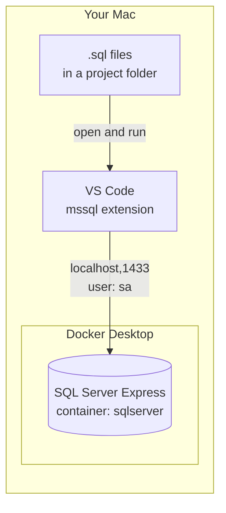
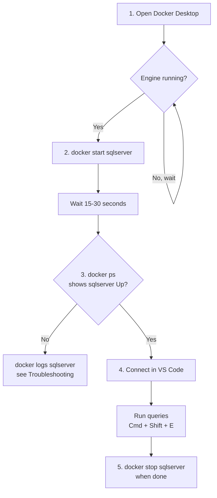
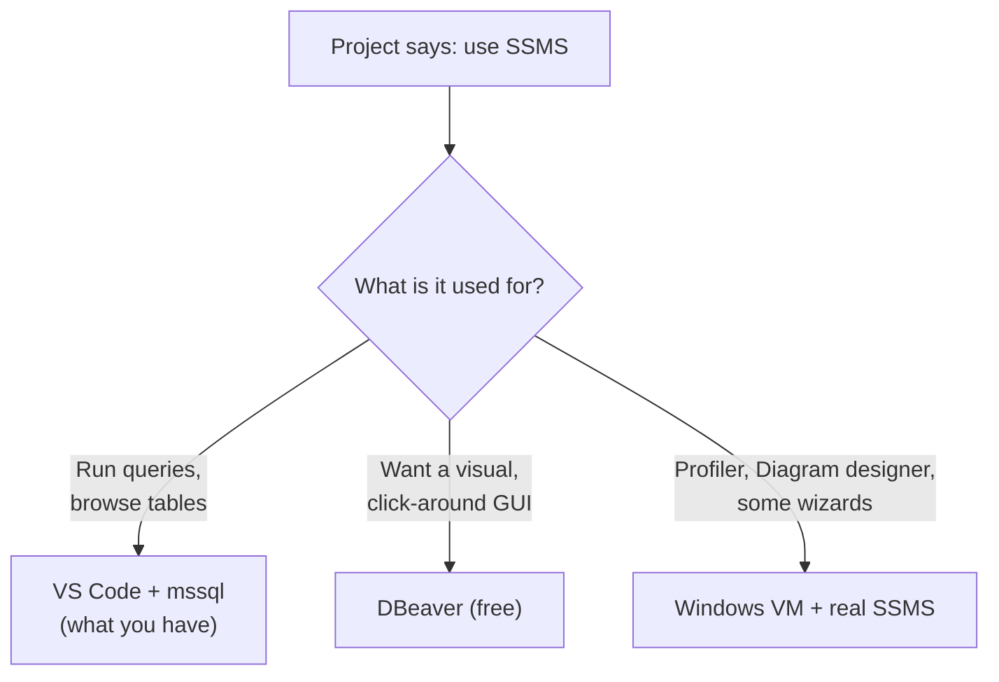
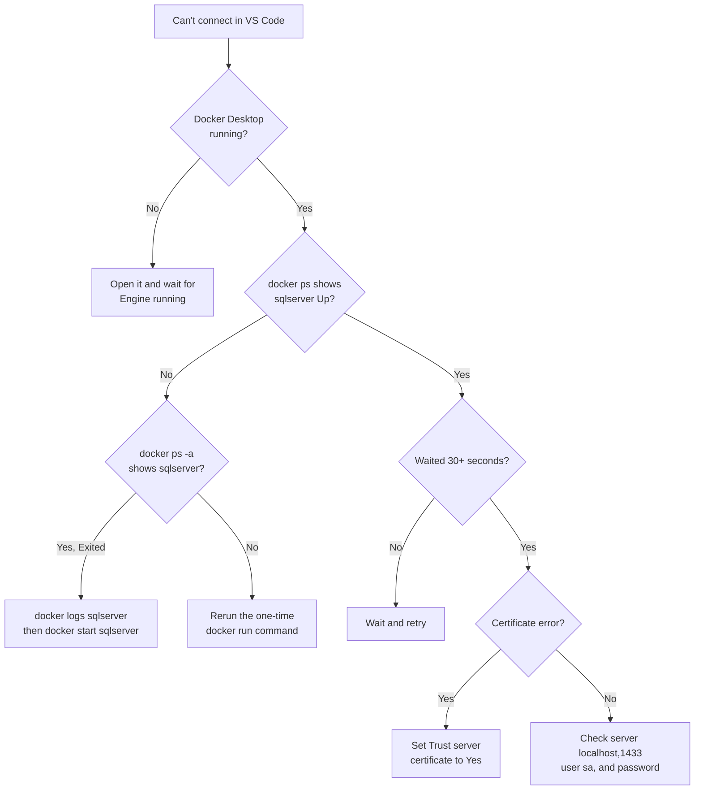

# SQL Server Express on Mac (Docker + VS Code)

> **Viewing the diagrams:** they're written in Mermaid. They render automatically on GitHub. In VS Code, install the **"Markdown Preview Mermaid Support"** extension, then open the preview with **Cmd + Shift + V**.

SQL Server Express and SSMS don't run natively on macOS. This setup runs SQL Server in a Docker container and connects to it from VS Code.

## How It Fits Together



## Quick Start




**1. Start Docker Desktop** and wait for "Engine running" (bottom left).

**2. Start the container** (Terminal):
```bash
docker start sqlserver
```
Wait 15-30 seconds for SQL Server to finish starting.

**3. Check it's running:**
```bash
docker ps
```
`sqlserver` should show status **Up**.

**4. Connect in VS Code:**
- Open the **SQL Server** icon in the left sidebar
- Click your saved connection (or **Add Connection** if none)
- Right-click it → **New Query** → run `SELECT @@VERSION;` to test

**5. When done:**
```bash
docker stop sqlserver
```

## Connection Details

| Setting | Value |
|---|---|
| Server | `localhost,1433` |
| Authentication | SQL Login |
| User | `sa` |
| Password | the `MSSQL_SA_PASSWORD` you set (see below) |
| Trust server certificate | **Yes** |

## What About SSMS?



**SSMS (SQL Server Management Studio) is Windows-only and does not run on Mac.** You don't need it: VS Code with the mssql extension covers running queries and browsing objects.

| Option | Notes |
|---|---|
| **VS Code + mssql** (current setup) | Write/run queries, browse tables, view results |
| **DBeaver** (free) | Fuller GUI: object tree, table editors, ER diagrams. Same connection details as above |
| **DataGrip** (paid) | Most polished option |
| **Azure Data Studio** | Retired by Microsoft in early 2026. Skip it |
| **Windows VM (Parallels/VMware Fusion/UTM) + SSMS** | Only if the project truly needs SSMS-only features (Profiler, Database Diagram designer, some wizards) |

**Translating project instructions that say "do this in SSMS":**
- "Connect with Windows Authentication" → use **SQL Login** (`sa` + password)
- "Connect to `.\SQLEXPRESS` or `localhost\SQLEXPRESS`" → use **`localhost,1433`**
- "New Query window" → open a `.sql` file in VS Code, connect, **Cmd + Shift + E**
- "Object Explorer" → the **SQL Server** sidebar in VS Code
- "Select Top 1000 Rows" → right-click the table in the sidebar → **Select Top 1000**

See `SQL_WORKFLOW.md` for creating, saving, and running your own `.sql` files.

## What Was Done (One-Time Setup)

1. Installed **Docker Desktop** for Mac.
2. Created the SQL Server Express container (Terminal, any folder):
   ```bash
   docker run --platform linux/amd64 -e 'ACCEPT_EULA=Y' -e 'MSSQL_SA_PASSWORD=YourStrong!Passw0rd' -e 'MSSQL_PID=Express' -p 1433:1433 --name sqlserver -d mcr.microsoft.com/mssql/server:2022-latest
   ```
   - `--platform linux/amd64` is needed on Apple Silicon Macs.
   - `MSSQL_PID=Express` selects the Express edition.
   - Single quotes are required: in zsh, a `!` inside double quotes causes `event not found`.
3. Installed the **SQL Server (mssql)** extension in VS Code.
4. Added a connection and verified it:
   ```sql
   SELECT @@VERSION;
   ```
   Result: SQL Server 2022 Express Edition on Linux (Ubuntu 22.04).

## Troubleshooting

**Start here if you can't connect:**



**Common errors:**

| Problem | Fix |
|---|---|
| `zsh: command not found: docker` | Quit and reopen Docker Desktop and Terminal. Or Docker Desktop → Settings → Advanced → CLI tools → **System**. |
| `zsh: event not found` | Use single quotes around values containing `!`. |
| Container not in `docker ps` | Run `docker ps -a`, then `docker logs sqlserver` to see why it exited. |
| Crashes on Apple Silicon | Docker Desktop → Settings → General → enable **Use Rosetta for x86/amd64 emulation**, then `docker rm sqlserver` and rerun the setup command. |
| Connection refused | Wait 15-30 seconds after starting and retry. |
| Certificate error in VS Code | Set **Trust server certificate** to **Yes**. |
| "Name already in use" on `docker run` | The container already exists. Use `docker start sqlserver` instead. |

## Useful Commands

```bash
docker start sqlserver       # start
docker stop sqlserver        # stop
docker ps                    # list running containers
docker ps -a                 # list all containers (including stopped)
docker logs sqlserver        # view SQL Server logs
```

## Things to Know

- **Data persists across stop/start**, but is **lost if you run `docker rm sqlserver`**.
- To keep data even if the container is deleted, recreate it with a volume: add `-v sqlserver_data:/var/opt/mssql` to the `docker run` command.
- **Not available on Mac:** Windows Authentication and some SSMS-only tools (e.g. Profiler). Standard T-SQL, tables, and stored procedures work fine.
- **Loading data:** run `.sql` scripts from VS Code against your connection. For a `.bak` file, copy it in with `docker cp file.bak sqlserver:/var/opt/mssql/` and restore with `RESTORE DATABASE`.
