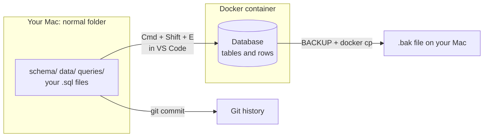
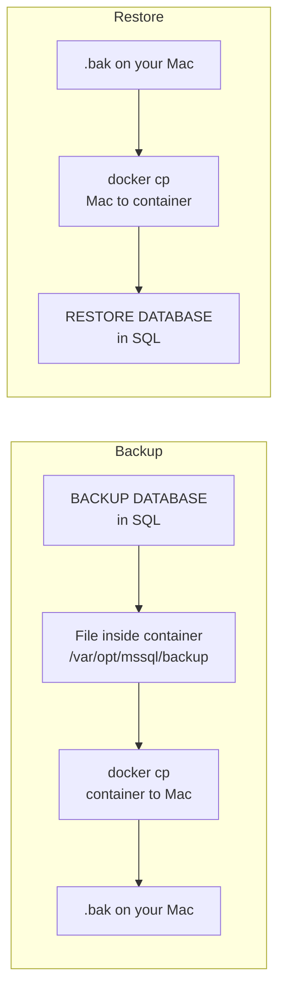
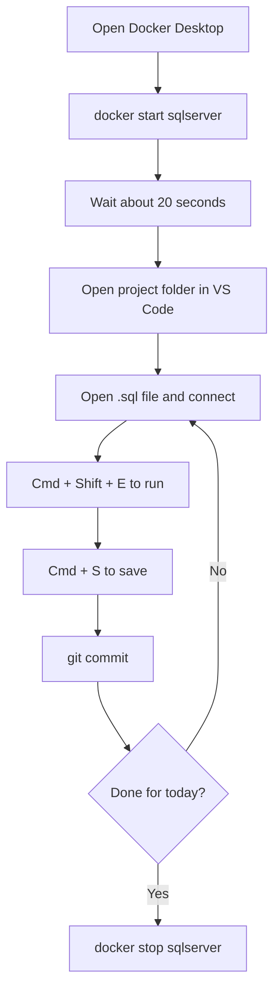

# Working in SQL Server (Mac + Docker + VS Code)

> **Viewing the diagrams:** they're written in Mermaid. They render automatically on GitHub. In VS Code, install the **"Markdown Preview Mermaid Support"** extension, then open the preview with **Cmd + Shift + V**.

## The Key Idea

There are **two separate things**, stored in two different places:

| Thing | Where it lives | How to keep it safe |
|---|---|---|
| **Your SQL files** (`.sql` scripts) | A normal folder on your Mac | Save them like any file. Back up with Git. |
| **The database itself** (tables, rows) | Inside the Docker container | Use a Docker volume and/or `.bak` backups. |



**Rule of thumb:** treat your `.sql` files as the source of truth. If the container is ever lost, you can rebuild the whole database by re-running them.

## Starting a New Project

**1. Make a project folder** (Terminal):
```bash
mkdir -p ~/projects/my-sql-project && cd ~/projects/my-sql-project
git init
code .
```
If `code .` doesn't work, open VS Code and use **File → Open Folder**.

**2. Suggested structure:**
```
my-sql-project/
├── README.md
├── schema/        # CREATE TABLE, views, procedures
│   ├── 01_create_database.sql
│   ├── 02_create_tables.sql
│   └── 03_create_views.sql
├── data/          # INSERT scripts, seed data
│   └── 01_seed_data.sql
└── queries/       # SELECTs, reports, experiments
    └── customer_report.sql
```
- **Number files** (`01_`, `02_`) so the run order is obvious.
- Use **`.sql`** as the extension so VS Code recognizes them.

**3. Create a file:** right-click the folder in VS Code's sidebar → **New File** → name it `something.sql`.

## Running a Script

1. Start Docker Desktop and `docker start sqlserver` (see README.md Quick Start).
2. Open your `.sql` file.
3. **Connect it to the server:** click the connection prompt at the bottom of VS Code (or Cmd + Shift + P → **MS SQL: Connect**) and pick your saved profile.
4. **Run it:** **Cmd + Shift + E** (or Cmd + Shift + P → **MS SQL: Execute Query**).
5. **Run only part of a file:** highlight the lines first, then run. Only the selection executes.

## SSMS Instructions → VS Code Equivalents

Projects often say "do this in SSMS." SSMS is Windows-only, so translate:

| Project says | Do this on your Mac |
|---|---|
| Open a New Query window | Open or create a `.sql` file in VS Code, connect it |
| Execute (F5) | **Cmd + Shift + E** |
| Object Explorer | **SQL Server** sidebar in VS Code (Databases → Tables) |
| Right-click table → Select Top 1000 Rows | Right-click table in sidebar → **Select Top 1000** |
| Connect with Windows Authentication | Use **SQL Login**: `sa` + your password |
| Server: `.\SQLEXPRESS` or `localhost\SQLEXPRESS` | Server: `localhost,1433` |

**Features that may not have a VS Code equivalent:** Import Data wizard, Database Diagram designer, Profiler. **DBeaver** (free) covers most of these. A Windows VM with real SSMS is the last resort.

## Script Habits That Save Pain

**Pick the database first.** Every connection starts in `master`, which is not where you want your tables:
```sql
USE MyDatabase;
GO
```

**Make scripts re-runnable**, so running them twice doesn't error:
```sql
IF DB_ID('MyDatabase') IS NULL
    CREATE DATABASE MyDatabase;
GO

USE MyDatabase;
GO

DROP TABLE IF EXISTS dbo.Customers;
GO

CREATE TABLE dbo.Customers (
    CustomerID INT IDENTITY(1,1) PRIMARY KEY,
    Name       NVARCHAR(100) NOT NULL,
    Email      NVARCHAR(255)
);
GO
```
- **`GO`** separates batches. It's a client keyword, not T-SQL. The VS Code extension understands it.
- **Careful with `DROP TABLE`:** it deletes the data. Fine for dev, dangerous with real data.

## Saving and Versioning

**Git basics** (from your project folder):
```bash
git add .
git commit -m "Add customers table"
```
Commit after each working change. If you break something, you can go back.

**Don't commit** passwords or `.bak` files. Add a `.gitignore`:
```
*.bak
.env
```

## Backing Up the Database



**1. Create a backup inside the container:**
```sql
BACKUP DATABASE MyDatabase
TO DISK = '/var/opt/mssql/backup/MyDatabase.bak';
```
(If it complains about the folder, run `docker exec -u 0 sqlserver mkdir -p /var/opt/mssql/backup` and `docker exec -u 0 sqlserver chown mssql /var/opt/mssql/backup` first.)

**2. Copy it to your Mac:**
```bash
docker cp sqlserver:/var/opt/mssql/backup/MyDatabase.bak ~/projects/my-sql-project/
```

**Restoring a `.bak` from your Mac:**
```bash
docker cp MyDatabase.bak sqlserver:/var/opt/mssql/backup/
```
```sql
RESTORE DATABASE MyDatabase
FROM DISK = '/var/opt/mssql/backup/MyDatabase.bak'
WITH REPLACE;
```
If the restore errors on file paths, run `RESTORE FILELISTONLY FROM DISK = '...'` to see the logical names, then add `WITH MOVE` clauses.

## Protecting Your Data from `docker rm`

The container's data disappears if you delete the container. To prevent that, create it with a volume (only needed once, if you ever recreate the container):
```bash
docker run --platform linux/amd64 -e 'ACCEPT_EULA=Y' -e 'MSSQL_SA_PASSWORD=YourStrong!Passw0rd' -e 'MSSQL_PID=Express' -p 1433:1433 -v sqlserver_data:/var/opt/mssql --name sqlserver -d mcr.microsoft.com/mssql/server:2022-latest
```
The `-v sqlserver_data:/var/opt/mssql` part keeps the data in a Docker volume that survives `docker rm`.

## Daily Workflow Cheat Sheet



1. Open Docker Desktop, wait for "Engine running"
2. `docker start sqlserver`, then wait about 20 seconds
3. Open your project folder in VS Code
4. Open a `.sql` file → connect → **Cmd + Shift + E** to run
5. Save the file (**Cmd + S**), commit with Git
6. When finished: `docker stop sqlserver`
